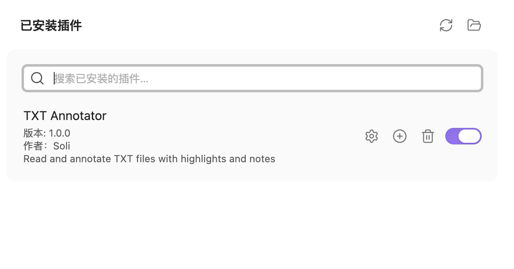
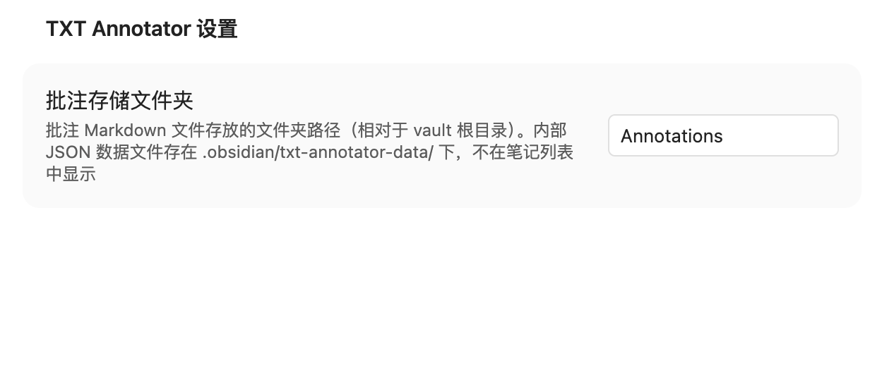
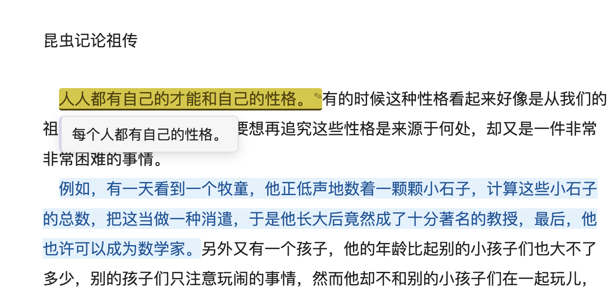
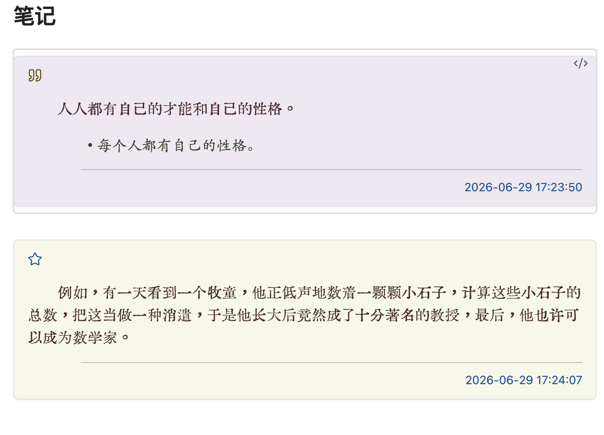
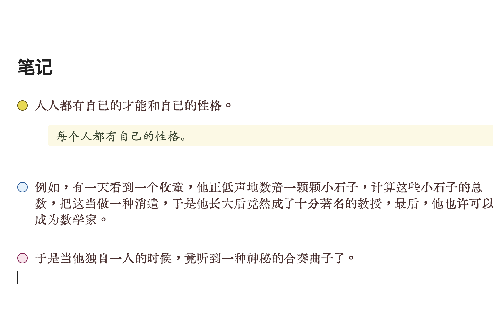
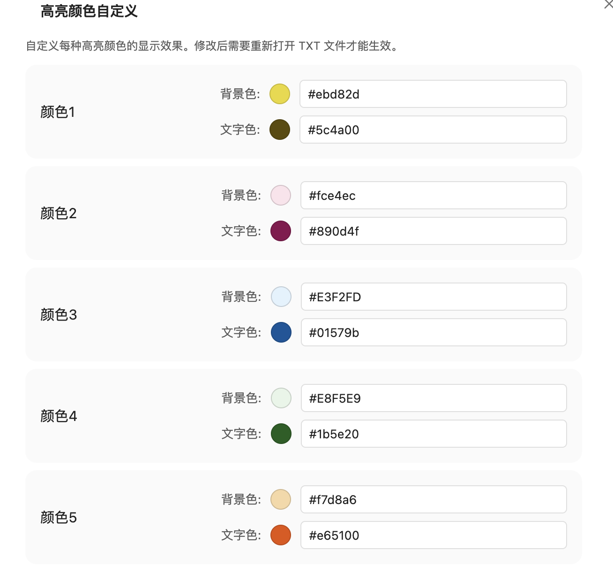
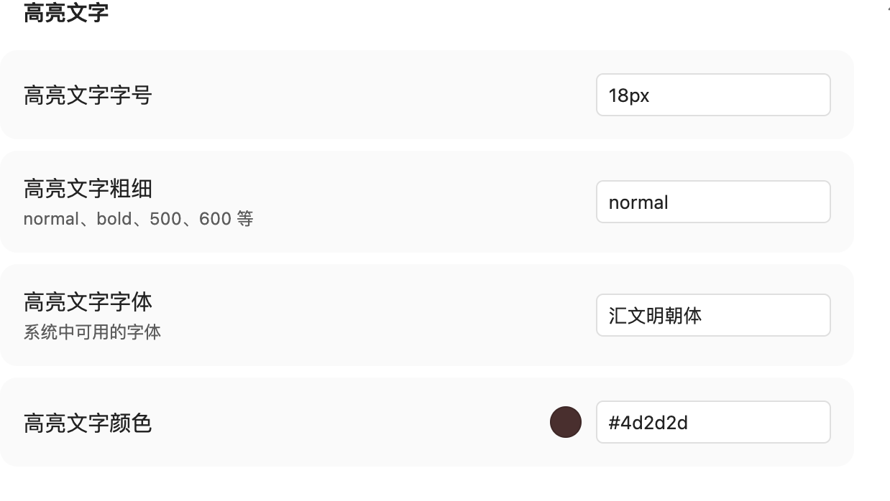
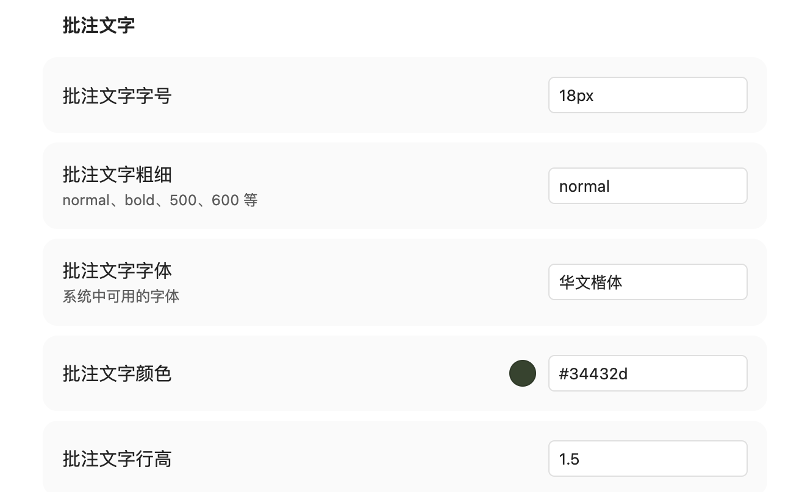
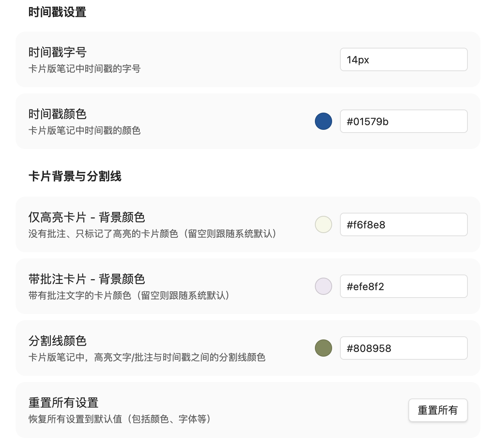

# TXT Annotator for Obsidian

**在 Obsidian 中阅读 TXT 文件，支持高亮划线与批注，并自动生成结构化笔记。**

Read and annotate TXT files directly in Obsidian — highlight text, add notes, and auto-generate structured Markdown notes.

---

## 功能特性 / Features

### 🇨🇳 中文

- **TXT 阅读器**：直接在 Obsidian 中打开 `.txt` 文件，无需切换外部工具
- **五色高亮**：选中文字后一键标记，支持五种颜色，可自定义
- **批注**：为每条高亮添加文字批注，悬停即可预览
- **自动生成笔记**：所有划线与批注自动同步到对应的 Markdown 笔记文件，删除高亮后笔记同步更新
- **两种笔记样式**：卡片版（带时间戳、分割线）和简洁版，可在设置中切换
- **跳转定位**：按住 `Ctrl`（Windows/Linux）或 `Cmd`（macOS）点击高亮文字，直接跳转到笔记中对应位置
- **滚动记忆**：自动记录每个文件的阅读进度，下次打开从上次位置继续
- **深度自定义**：高亮颜色、字号、字体、字重、批注样式、时间戳、卡片背景色均可在设置中调整

### 🇬🇧 English

- **TXT Reader**: Open `.txt` files directly inside Obsidian
- **Five highlight colors**: Colors customizable，select text to highlight instantly
- **Annotations**: Attach text notes to any highlight; hover to preview
- **Auto-generated notes**: All highlights and annotations sync to a Markdown file automatically; deleting a highlight updates the note accordingly
- **Two note styles**: Card style (with timestamps and dividers) or Simple style — switchable in settings
- **Jump to note**: Hold `Ctrl` (Windows/Linux) or `Cmd` (macOS) and click a highlight to jump to its position in the note file
- **Scroll memory**: Reading position is saved per file and restored on next open
- **Deep customization**: Highlight colors, font size, weight, family, note style, timestamps, and card backgrounds are all configurable

---

## 安装方法 / Installation

### 手动安装 / Manual Install

#### 🇨🇳 中文

1. 前往 [Releases](https://github.com/heeeyc/obsidian-txt-annotator/releases) 页面，下载最新版本的 `main.js`、`styles.css`、`manifest.json`
2. 在你的 Vault 中找到 `.obsidian/plugins/` 目录，新建文件夹 `txt-annotator`
3. 将三个文件放入该文件夹
4. 重启 Obsidian，或在设置 → 第三方插件页面点击右上角刷新按钮
5. 找到 **TXT Annotator**，点击启用
 

#### 🇬🇧 English

1. Go to the [Releases](https://github.com/heeeyc/obsidian-txt-annotator/releases) page and download `main.js`, `styles.css`, and `manifest.json`
2. In your vault, navigate to `.obsidian/plugins/` and create a folder named `txt-annotator`
3. Place the three files inside that folder
4. Restart Obsidian, or click the refresh button in Settings → Community plugins
5. Find **TXT Annotator** and enable it

### 通过社区插件市场安装 / Community Plugin Store

> 即将上架 / Coming soon

在 Obsidian 设置 → 社区插件 → 浏览，搜索 **TXT Annotator** 即可一键安装。

Search for **TXT Annotator** in Obsidian Settings → Community plugins → Browse.

---

## 使用方法 / Usage

### 🇨🇳 中文

#### 一、前置步骤

在 Obsidian 中创建一个文件夹，用来存放 TXT 文件生成的笔记。

#### 二、设置插件

点击 TXT Annotator 旁的设置齿轮，将笔记存放路径修改为你创建的文件夹。若跳过此步骤，插件默认生成名为 `Annotations` 的文件夹存放笔记。

#### 三、笔记标注

1. 将 TXT 文件（**仅支持 UTF-8 编码**）拖入 Obsidian，可与笔记放在同一文件夹，也可单独存放，不影响笔记生成与存储
2. 在文件列表中点击 TXT 文件，自动在阅读器中打开
3. 选中文字，浮出颜色选择框，点击颜色即可高亮；点击 **✎ 批注** 可同时添加文字备注
4. 点击已有高亮，弹出菜单可修改颜色、编辑批注或删除高亮
5. 高亮与批注会自动同步生成同名 Markdown 笔记文件；删除高亮后笔记同步更新

6. 生成的笔记文件有两种显示方式：简洁版和卡片版（带时间戳、分割线），可在设置中进行切换

#### 四、其他功能

1. 按住 `Ctrl`（Windows/Linux）或 `Cmd`（macOS）点击高亮文字，跳转到笔记文件中对应位置
2. 关闭 TXT 文件再打开时，自动定位到上次阅读位置
3. 高亮颜色、笔记文字的字体/字号/颜色，以及卡片背景色、分割线、时间戳样式均可在设置中自定义

---

### 🇬🇧 English

#### Step 1 — Prepare a folder

Create a folder in your Obsidian vault to store the generated annotation notes.

#### Step 2 — Configure the plugin

Click the gear icon next to TXT Annotator in the Community plugins list and set the annotation folder to the one you created. If skipped, the plugin defaults to a folder named `Annotations`.

#### Step 3 — Annotate

1. Drag a TXT file (**UTF-8 encoding only**) into Obsidian — it can live anywhere in your vault without affecting where notes are saved
2. Click the TXT file in the file explorer to open it in the reader
3. Select text to bring up the color picker; click a color to highlight, or click **✎ 批注** to add a written note at the same time
4. Click an existing highlight to change its color, edit the note, or delete it
5. A Markdown note file is automatically created and kept in sync — deleting a highlight removes it from the note too

#### Step 4 — Extra features

- Hold `Ctrl` (Windows/Linux) or `Cmd` (macOS) and click a highlight to jump to its exact position in the note file
- Reopen a TXT file and the reader automatically returns to where you left off
- Highlight colors, note font/size/color, card backgrounds, dividers, and timestamps are all customizable in settings

---

## 设置说明 / Settings

| 设置项 / Setting | 说明 / Description |
|---|---|
| 笔记保存文件夹 / Annotation folder | 自动生成的 `.md` 笔记的保存位置 |
| 笔记样式 / Note style | 卡片版 (card) 或 简洁版 (simple) |
| 高亮颜色 / Highlight colors | 五种颜色的背景色与文字色均可自定义 |
| 高亮文字字号/字重/字体 / Highlight font | 阅读器中高亮文字的显示样式 |
| 批注文字字号/字重/字体 / Note font | 笔记文件中批注文字的显示样式 |
| 时间戳样式 / Timestamp style | 卡片版笔记中时间戳的字号与颜色 |
| 卡片背景色 / Card background | 有/无批注卡片分别设置背景色 |
| 分割线颜色 / Divider color | 卡片中分割线的颜色 |

---

## 注意事项 / Notes

### 🇨🇳 中文

- 本插件仅支持 **UTF-8 编码**的 TXT 文件，其他编码可能导致乱码
- 插件会在 `.obsidian/` 目录下自动生成 `txt-annotator-data/` 文件夹，用于存储划线数据与阅读位置，**请勿删除**
- 原始 TXT 文件不会被修改

### 🇬🇧 English

- Only **UTF-8 encoded** TXT files are supported; other encodings may display incorrectly
- The plugin automatically creates a `txt-annotator-data/` folder inside `.obsidian/` to store annotation data and scroll positions — **do not delete it**
- Your original TXT files are never modified

---

## 兼容性 / Compatibility

- Obsidian 最低版本 / Minimum version: **1.4.0**
- 支持桌面端与移动端 / Supports desktop and mobile

---

## License

[MIT](LICENSE)
